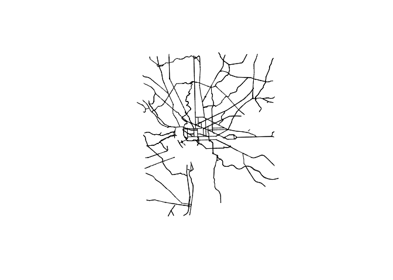

Compute Travel Time: Raster-Based Approach
================

-   [Prep Points and and Roads Data](#prep-points-and-and-roads-data)
    -   [Set up](#set-up)
    -   [Create example points](#create-example-points)
    -   [Grab and clean road data from
        OSM](#grab-and-clean-road-data-from-osm)
-   [Calculate travel time, shortest path and market
    access](#calculate-travel-time-shortest-path-and-market-access)
    -   [Rasterize roads and make transition
        object](#rasterize-roads-and-make-transition-object)
    -   [Travel times & shortest paths from one location to all
        others](#travel-times--shortest-paths-from-one-location-to-all-others)
    -   [Travel time matrix](#travel-time-matrix)
    -   [Market access](#market-access)

This document describes computing travel time using a raster-based
approach. “Raster-based” means we convert poylines into a raster, where
each pixel in the raster indicates the time it takes to travel across
the raster (for example, for a 1km pixel, if a 60km/h road passes
through the pixel, it would take 1 minute to pass through the pixel). We
can then convert this raster into a “transition object”, which allows
easily computing travel times and shortest paths between any two
locations relying on the [gdistance
package](https://cran.microsoft.com/snapshot/2014-12-09/web/packages/gdistance/vignettes/gdistance.pdf).

The first part of the document creates and prepares (1) point data for
locations in Washington, DC where we want to calculate travel times
between and (2) road data for Washington, DC.

The second part of the document creates the transition object, then uses
that object to compute travel times, shortest paths, and a measure of
market access.

Instead of a raster-based approach, one could convert the road polyline
into graph, and compute travel times between nodes in the graph. The
benefit of a raster-based approach is that it doesn’t require converting
the road network polyline into a graph, which in some instances can
require a fair bit of work. However, see
[here](https://r-spatial.org/r/2019/09/26/spatial-networks.html) for an
example of a using this graph/network-based approach.

# Prep Points and and Roads Data

Here we: 1. Prep a `SpatialPoints` object of locations to calculate
travel times between 2. Prep a `SpatialPolyline` object of roads

## Set up

Here, we (1) load packages, (2) import travel time functions, and (3)
define the projection to use on the data (the travel time functions
assume the data are projected).

``` r
## Load packages
library(rmarkdown)
library(dplyr)
library(sp)
library(sf)
library(rgeos)
library(raster)
library(gdistance)
library(velox)
library(osmdata)
library(stringr)
library(leaflet)

## Travel Time & MA Functions
source("https://raw.githubusercontent.com/ramarty/dime-ieconnect/main/travel-time-raster/travel-time-raster.R")

## Define projection
UTM_PROJ <- "+init=epsg:3968"
```

## Create example points

Create example points to calculate travel time between.
#CB: Tip: When computing travel time between polygons, compute their centroids

``` r
locs_sp <- bind_rows(
  data.frame(name = "national cathedral",
             lat = 38.930589,
             lon = -77.070803),
  
  data.frame(name = "capitol",
             lat = 38.889867,
             lon = -77.009064),
  
  data.frame(name = "world bank",
             lat = 38.898987,
             lon = -77.042402),
  
  data.frame(name = "takoma metro",
             lat = 38.975616,
             lon = -77.017906)
)

## Add unique ID
locs_sp$id <- 1:nrow(locs_sp)

## Spatially define
coordinates(locs_sp) <- ~lon+lat
crs(locs_sp) <- CRS("+init=epsg:4326")

## Project
locs_sp <- spTransform(locs_sp, CRS(UTM_PROJ))
```

``` r
leaflet() %>%
  addTiles() %>%
  addCircles(data = locs_sp %>% spTransform("+init=epsg:4326"), 
             popup = ~name,
             weight = 15,
             opacity = 1)
```

<!-- -->

## Grab and clean road data from OSM

Here, we grab road network data from OpenStreetMaps for Washington, DC.
The code for calculating travel times assumes the spatial data is
projected.

#CB: To compute travel time, we use road quality as a proxy for travel speeds and assign speeds defined by GOSTNets (insert link)

``` r
#### Import OSM road data
q <- opq(bbox = 'washington dc') %>%
  add_osm_feature(key = 'highway', value = c('trunk',
                                             'primary')) %>%
  osmdata_sp()

roads_sp <- q$osm_lines

#### Assign speed limits
roads_sp$speed_kmhr <- NA
roads_sp$speed_kmhr[roads_sp$highway %in% "primary"] <- 30
roads_sp$speed_kmhr[roads_sp$highway %in% "trunk"]   <- 60

## Project
roads_sp <- spTransform(roads_sp, UTM_PROJ)
```

``` r
plot(roads_sp)
```

<!-- -->

# Calculate travel time, shortest path and market access

The below code illustrates using the road network data to calculate
travel time between different locations. We: 
1. Rasterize roads and make a transition object. The transition object allows us to pick any two points on the surface 
and easily get the travel time and shortest path
2. Compute travel time and shortest paths from one location to all locations 
3. Create a travel time matrix that includes the travel time between all locations 
4. Compute a measure of market access for each location

## Rasterize roads and make transition object

``` r
#### Rasterize roads
roads_r <- rasterize_roads(road_sdf = roads_sp,
                           speed_var = "speed_kmhr",
                           pixel_size_km = 0.1) 
                           #CB: It would be helpful to describe the "pixel_size_km" parameter and some common mistakes. e.g., increasing pixel size
                     

#### Make transition object
cost_t <- transition(roads_r, function(x) 1/mean(x), directions=8)  
#CB: Helpful to annotate this code. For example, why we use "1/mean(x)" and "directions = 8"

```

``` r
plot(roads_r)

#CB: For more clarity, you could describe what the plot depicts
```

<!-- -->

## Travel times & shortest paths from one location to all others

We calculate the travel time from the World Bank to the other locations
and create polylines of the shortest paths.

``` r
## Make separate spatial dataframes for (1) origin and (2) destinations 
o_sp  <- locs_sp[locs_sp$name == "world bank",]
ds_sp <- locs_sp[locs_sp$name != "world bank",]

## Create polylines of shortest paths
od_paths_sp <- shortestPath(cost_t, 
                            o_sp, 
                            ds_sp, 
                            output="SpatialLines")

## Add Travel time
od_paths_sp$travel_time_hr <- costDistance(cost_t,
                                           o_sp,
                                           ds_sp) %>% 
  as.numeric()

## Add o-d names to dataframe
od_paths_sp$o_name <- "world bank"
od_paths_sp$d_name <- ds_sp$d_name
```

``` r
print(od_paths_sp@data)
```

    ##   travel_time_hr     o_name
    ## 1      0.1583333 world bank
    ## 2      0.1316667 world bank
    ## 3      0.3000000 world bank

``` r
plot(roads_r)
plot(od_paths_sp, add = T)
```

<!-- -->

## Travel time matrix

Here, we create a travel time matrix that computes the travel time from
each location to all other locations.

``` r
tt_df <- make_tt_matrix(points_sdf = locs_sp,
                        uid_name   = "id",
                        cost_t     = cost_t)
```

``` r
print(tt_df)
```

    ##    dest_id travel_time distance_meters orig_id
    ## 1        1   0.0000000           0.000       1
    ## 2        2   0.2500000        7006.834       1
    ## 3        3   0.1583333        4285.919       1
    ## 4        4   0.4016667        6782.076       1
    ## 5        1   0.2500000        7006.834       2
    ## 6        2   0.0000000           0.000       2
    ## 7        3   0.1316667        3063.789       2
    ## 8        4   0.3416667        9548.588       2
    ## 9        1   0.1583333        4285.919       3
    ## 10       2   0.1316667        3063.789       3
    ## 11       3   0.0000000           0.000       3
    ## 12       4   0.3000000        8766.580       3
    ## 13       1   0.4016667        6782.076       4
    ## 14       2   0.3416667        9548.588       4
    ## 15       3   0.3000000        8766.580       4
    ## 16       4   0.0000000           0.000       4

## Market access

Here, we compute a measure of market access. We rely on the travel time
matrix computed above. For the market access measure, we use population
(for example, this could be the population of the neighborhood in
Washington, DC; we just randomly generate this for illustration
purposes). Market access is computed as (where

refers to origin and

destination):


#CB: Adding a link to a market access paper for further explanation of the concept is a helpful resource to share
``` r
set.seed(42)
locs_sp$population <- runif(nrow(locs_sp))*10000

tt_data_df <- tt_df %>%
  left_join(locs_sp@data, by = c("dest_id" = "id"))

ma_df <- calc_ma(tt_df = tt_data_df,
                 orig_uid_var = "orig_id",
                 market_var = "population",
                 travel_cost_var = "travel_time",
                 theta = 3,
                 exclude_km = 0) 
                 #CB: Could add a line about parameters "theta" and "exclude_km" and how it impacts the market access measure
```

``` r
print(ma_df)
```

    ## # A tibble: 4 × 2
    ##   orig_uid MA_tt_population_theta3
    ##      <int>                   <dbl>
    ## 1        1                1448754.
    ## 2        2                2047262.
    ## 3        3                6717580.
    ## 4        4                 482089.
